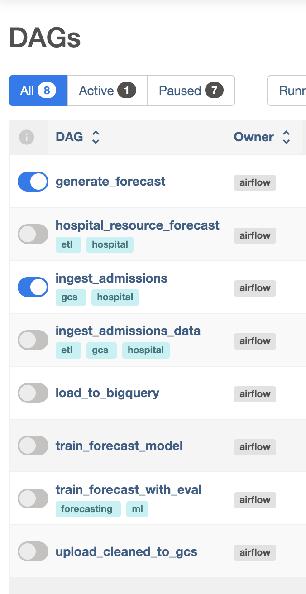

## Setup (WIP)

<i>This readME is for devs who'd like to setup and run your own copy of the project.</i>
 
<i>A Demo of the full project will be hosted in the future.</i>

<h3>You will need Docker to build this project.</h3>

1. Create a virtual environment and Install requirements.

         python -m venv <your_environment_name>
         pip install -r requirements.txt
2. Docker setup

   I composed in my IDE's local terminal with my container running on Docker Desktop. Adjust how this suits you best.

         docker compose up airflow-init

   Wait for this to finish. Then:

         docker compose up
3. Access Apache Airflow

   After your container is running: The Admin Portal is ran through Airflow, accessible on localhost:8080. User: admin, Password: admin.
    
   

4. We'll need to init the database to be able to run our DAGs.

   After your container is running ( open another terminal if running in your IDE )
   Confirm your DAGs are properly referenced by the container:

         docker logs hospital-forecasting-airflow-scheduler-1

   If you see a list of DAG jobs then init the db.

         docker exec -it hospital-forecasting-airflow-webserver-1 airflow db init

5. Verify DAGs
    
   Once logged in, you should see your DAGs under the DAGs tab.
    
   

6. Trigger a DAG
    
   From the Airflow UI, click on a DAG and manually trigger it to start the workflow.

### Setup Google Cloud Service

This project was made with integration with GCS/BigQuery in mind, to enable these relevant DAGs you will need a ( free ) Google Cloud api key.
These DAGs will be prefixed with gcs_ if you'd rather avoid this integration.

[//]: # (TODO: GCS setup)
