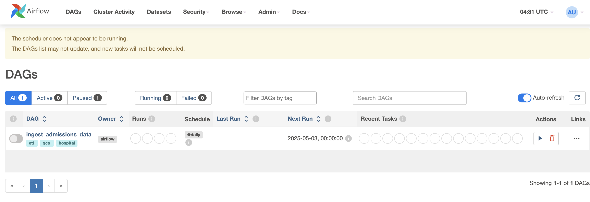

### Hospital Resource & Cost Forecasting Platform
 
This project simulates how a hospital might use data engineering and ETL pipelines to manage cost forecasts, explore coefficients through data science and handle department queries.

Objective:
Forecast hospital resource demand (beds, ICU units, staff) and patient cost using historical data. Provide analytics dashboards and ML-driven insights for hospital administrators.

        ┌──────────────┐         ┌────────────────┐
        │  Data Gen /  │ ─────▶ │ Raw GCS Bucket │
        │  Ingestion   │         └────────────────┘
        └────┬─────────┘
             ▼
     ┌─────────────────┐        ┌──────────────┐
     │ Kafka / PubSub  │ ─────▶ │  BigQuery     │ ◀────┐
     └─────────────────┘        └────┬──────────┘      │
                                     ▼                 ▼
                               ┌──────────────┐   ┌────────────┐
                               │   dbt        │   │ Jupyter DS │
                               │ Transform    │   │ Notebooks  │
                               └────┬─────────┘   └────┬───────┘
                                    ▼                  ▼
                            ┌────────────────┐   ┌───────────────┐
                            │ Dash / Airflow │ ◀▶│ REST API (Flask)│
                            │ Admin Dashboard │   └───────────────┘
                            └────────────────┘

Data Simulation 
 
This project simulates the following datasets:

1. Patient Admission Events (Daily)

        | patient_id | admit_date |	dept | severity | diagnosis | age |	insurance_type |
 

2. Procedures / Billing Records

        | procedure_id | patient_id | procedure | cost | performed_by | date |

3. Staffing Schedule
   
         | staff_id | role | department | shift_date | hours |

4. Bed /  ICU Occupancy
   
         | bed_id | dept | patient_id | start_time | end_time | is_ICU |

## Setup

1. Create a virtual environment and Install requirements.

         python -m venv <your_environment_name>
         pip install -r requirements.txt
2. Docker setup

   I composed in my IDE's local terminal with my container running on Docker Desktop. Adjust how this suits you best.

         docker compose up airflow-init

   Wait for this to finish. Then:

         docker compose up
3. Access Apache Airflow

   After your container is running: The Admin Portal is ran through Airflow, accessible on localhost:8080. User: admin, Password: admin.
 

 
   If you receive an invalid login in airflow ( on the webserver ) run:
      
         docker exec -it airflow-webserver airflow users create \
         --username admin \
         --password admin \
         --firstname Admin \
         --lastname User \
         --role Admin \
         --email admin@example.com

4. We'll need to init the database to be able to run our DAGs.

   After your container is running ( open another terminal if running in your IDE )
   Confirm your DAGs are properly referenced by the container:
      
         docker logs hospital-forecasting-airflow-scheduler-1
   
   If you see a list of DAG jobs then init the db.
         
         docker exec -it hospital-forecasting-airflow-webserver-1 airflow db init

5. Verify DAGs
 
Once logged in, you should see your DAGs under the DAGs tab.
 

6. Trigger a DAG
 
From the Airflow UI, click on a DAG and manually trigger it to start the workflow.

[//]: # (TODO: explain schedular and other dags)
