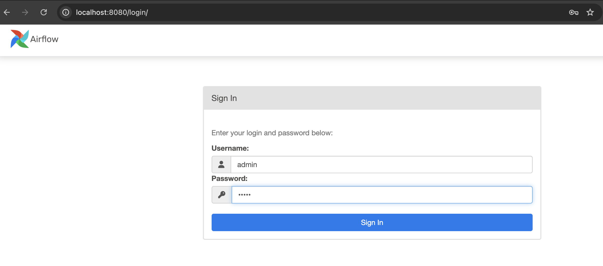
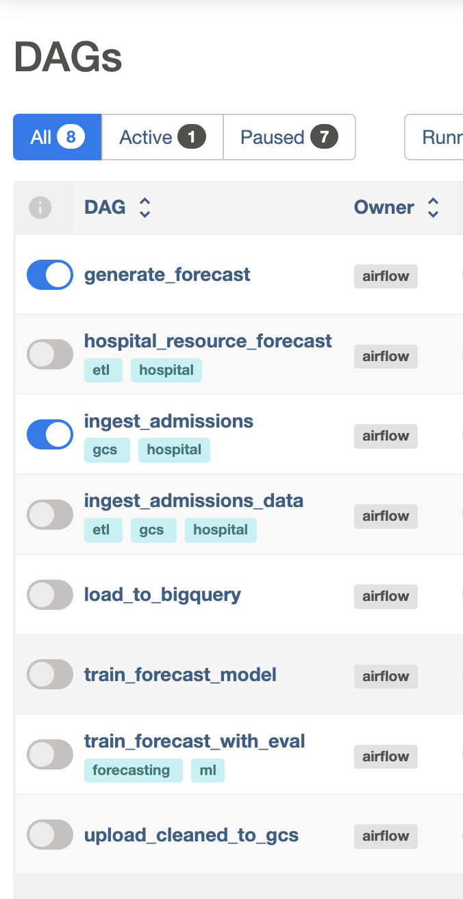

### Hospital Resource & Cost Forecasting Platform
 
This project simulates how a hospital might use data engineering and ETL pipelines to manage cost forecasts, explore coefficients through data science and handle department queries.

Objective:
Forecast hospital resource demand (beds, ICU units, staff) and patient cost using historical data. Provide analytics dashboards and ML-driven insights for hospital administrators.

        ┌──────────────┐         ┌────────────────┐
        │  Data Gen /  │ ─────▶ │ Raw GCS Bucket │
        │  Ingestion   │         └────────────────┘
        └────┬─────────┘
             ▼
     ┌─────────────────┐        ┌──────────────┐
     │ Kafka / PubSub  │ ─────▶ │  BigQuery     │ ◀────┐
     └─────────────────┘        └────┬──────────┘      │
                                     ▼                 ▼
                               ┌──────────────┐   ┌────────────┐
                               │   dbt        │   │ Jupyter DS │
                               │ Transform    │   │ Notebooks  │
                               └────┬─────────┘   └────┬───────┘
                                    ▼                  ▼
                            ┌────────────────┐   ┌───────────────┐
                            │ Dash / Airflow │ ◀▶│ REST API (Flask)│
                            │ Admin Dashboard │   └───────────────┘
                            └────────────────┘

Data Simulation 
 
This project simulates the following datasets:

1. Patient Admission Events (Daily)

        | patient_id | admit_date |	dept | severity | diagnosis | age |	insurance_type |
 

2. Procedures / Billing Records

        | procedure_id | patient_id | procedure | cost | performed_by | date |

3. Staffing Schedule
   
         | staff_id | role | department | shift_date | hours |

4. Bed /  ICU Occupancy
   
         | bed_id | dept | patient_id | start_time | end_time | is_ICU |

## Usage (WIP)

<i>A Demo of this project will be hosted in the future.</i>
 

1. Access Apache Airflow
 
The Admin Portal is ran through Airflow, User: admin, Password: admin.
 

2. Verify DAGs
 
Once logged in, you should see your DAGs under the DAGs tab.
 

3. Trigger a DAG
 
From the Airflow UI, click on a DAG and manually trigger it to start the workflow.

## DAGs and Workflow

<h3>This dashboard simulates a workspace that receives a daily and weekly reports to our mock hospital.</h3>
<ul>
<li>
<h4>generate_admission_dag</h4> 
Generates 1000 patients admitted to the hospital, running this DAG creates a .csv of this admission data every 24 hours.

Randomized categorical data is generated for the following patient fields: patient_id, admit_date, dept, severity, diagnosis, age, insurance_type

Daily files are uploaded to a GCS bucket.

</li>
<li>
<h4>ingest_admission_dag</h4>
Receives .csv files from Google Cloud 

Files output by generate_admission_dag are meant to be held in GCS to simulate reports sent by an admissions department.

This DAG downloads these files stored in an online GCS bucket. Locally stored in /opt/airflow/data/admissions/

</li>

</ul>

[//]: # (TODO: explain schedular and other dags)
